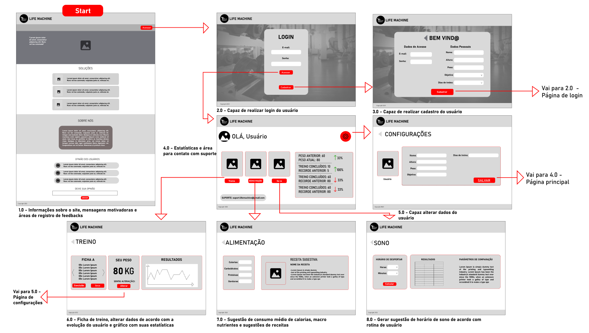
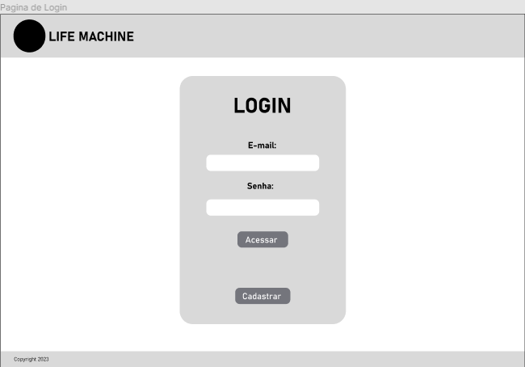

# Projeto de Interface

Visão geral da interação do usuário pelas telas do sistema e protótipo interativo das telas com as funcionalidades que fazem parte do sistema (wireframes).

## User Flow

## Wireframes

Página Inicial

Página de Login

Página de Cadastro

Página Principal

Página de configurações

Página de Alimentação

Página de Treino

Página de Sono

