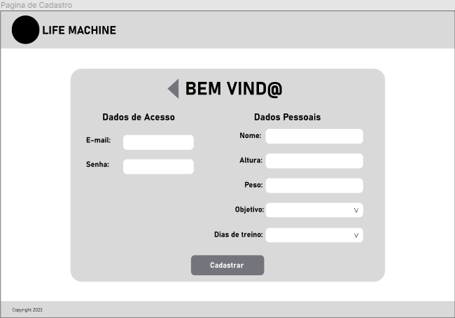
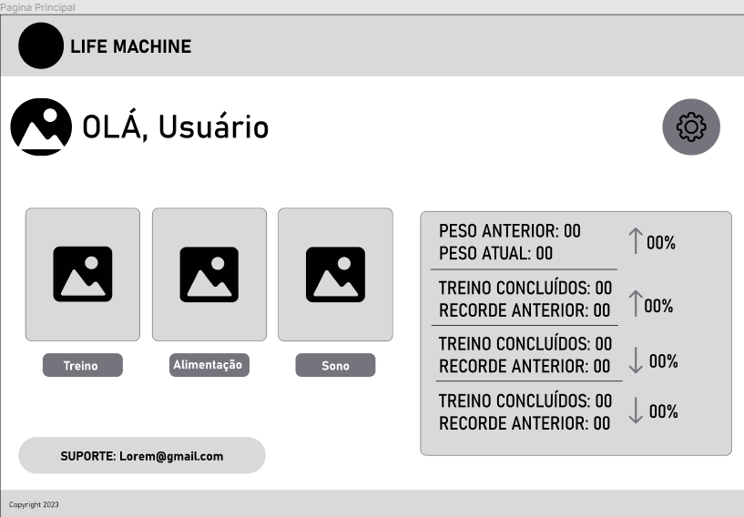
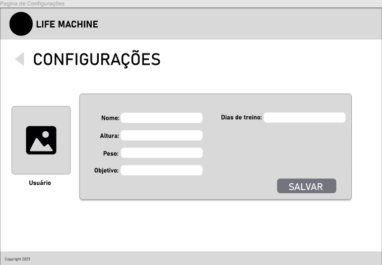
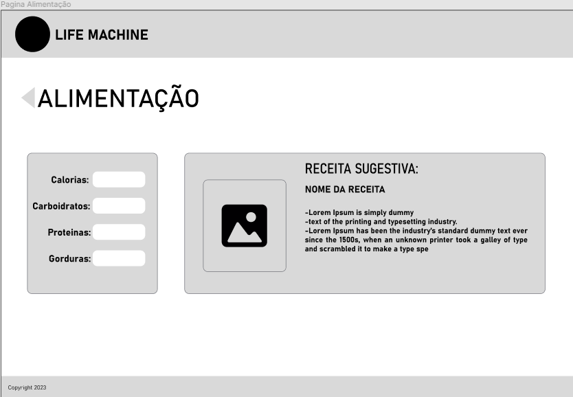
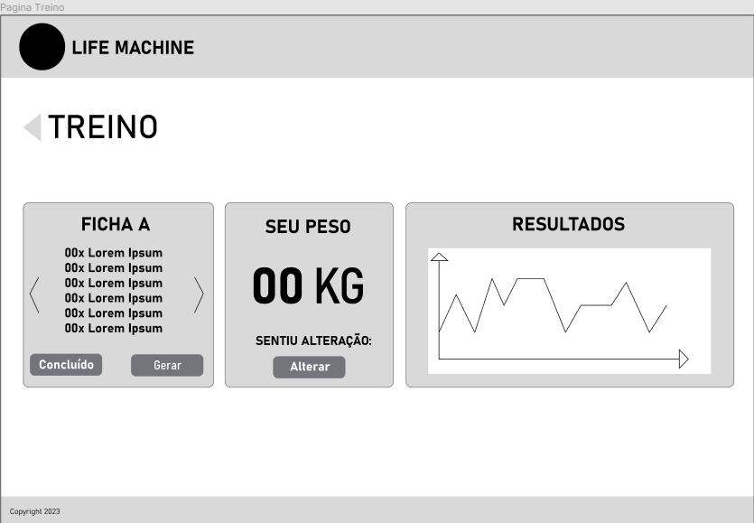
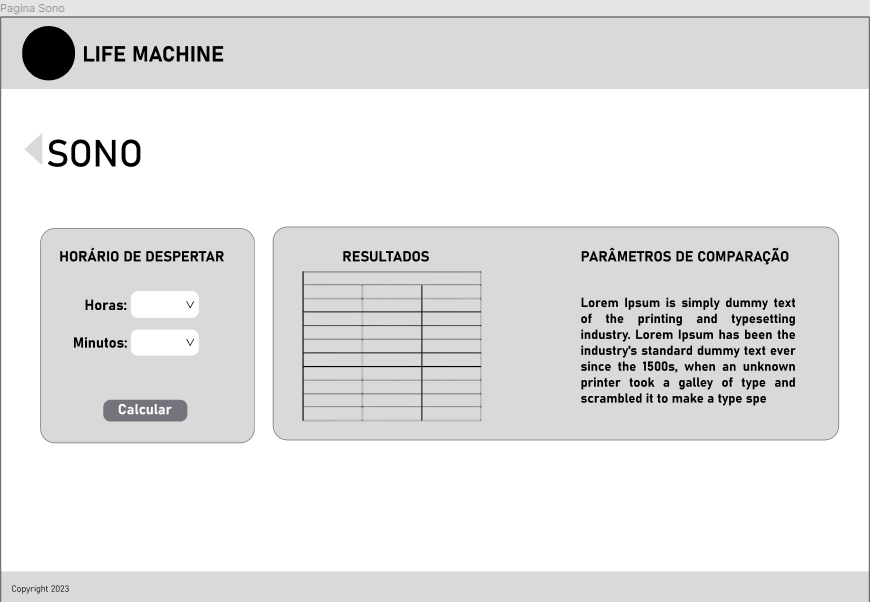

# Projeto de Interface

Visão geral da interação do usuário pelas telas do sistema e protótipo interativo das telas com as funcionalidades que fazem parte do sistema (wireframes).

## User Flow

## Wireframes

## Página Inicial

## Página de Login

## Página de Cadastro

## Página Principal

## Página de configurações

## Página de Alimentação

## Página de Treino

## Página de Sono

