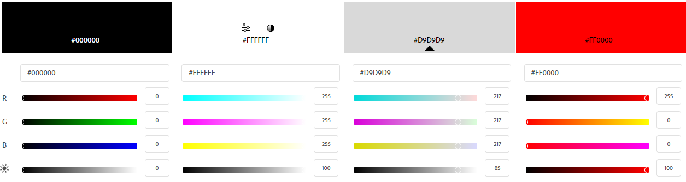
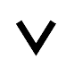
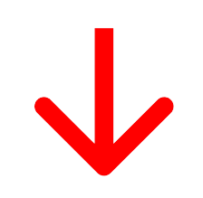

# Template padrão do site

## Design

Logo: Localizada na parte superior esquerda é a identidade visual da marca e desempenha um papel crucial na criação 
de reconhecimento e confiança junto aos visitantes.

Layout: O design desta página é pautado por princípios minimalistas, destacando a simplicidade e elegância em todos 
os detalhes facilitando e deixando o mais intuitivo possivel as açoes.

Menus de informações ao centro: Os menus de informações são posicionados ao centro da página. Os visitantes podem ser 
encontrar nelas uma variedade de recursos, desde informações sobre de acordo com a pagina que esta até artigos 
informativos e recursos interativos. A escolha de cores é minimalista, com tons de cinza que complementam o fundo 
branco, criando uma sensação de clareza.

Cores de fundo: O fundo branco cria um ambiente limpo e arejado, tornando a leitura e a navegação suaves. A 
cor preta e cinza é usada principalmente nos cabeçalhos e rodapés, conferindo um toque de sofisticação. Os botões da 
página são destacados em vermelho, proporcionando contraste e incentivando ações dos visitantes.

Design minimalista: O design minimalista da página prioriza a clareza, a simplicidade e a funcionalidade. Elementos 
decorativos desnecessários são evitados, e o foco está na apresentação do conteúdo de maneira organizada e atraente.
Isso não apenas torna a página atraente visualmente, mas também facilita a compreensão do conteúdo, tornando a experiência do usuário mais agradável.

Fonte: A fonte "Bahnschrift" possui uma estética moderna e limpa que se alinha perfeitamente com o design minimalista. Sua geometria simples e ausência de adornos a 
tornam uma escolha atraente para projetos que buscam uma aparência contemporânea e elegante.

## Cores

Paleta de cores :

Black / Preto	#000000

White / Branco  #FFFFFF

Gray /  Cinza  #D9D9D9

Red / Vermelho #FF0000

A escolha dessas cores foi para buscar algo simples e solido, como uma rotina. O preto, branco e cinza são frequentemente usados para criar um design limpo e descomplicado.

## Tipografia

Para a composição geral do site, optamos por usar a fonte "Bahnschrift".

Título do Projeto: Bahnschrift Negrito (30px)

Título das Seções: Bahnschrift Regular (52px)

Textos em geral: Bahnschrift Negrito (15-20px)

Botões: Bahnschrift Negrito (20px)

Rótulos de inputs: Bahnschrift Negrito (20px)

## Iconografia

### Logo do projeto/identidade da marca utilizado nos cabeçlhos

### Simples seta, utilizada em dropdown buttons
 

### Seta na horizontal, utilizada para retornar a página anterior

### Seta vermelha utilizada para demonstrar uma piora em certas estatísticas

### Seta verde utilizada para demonstrar uma melhora em certas estatísticas

